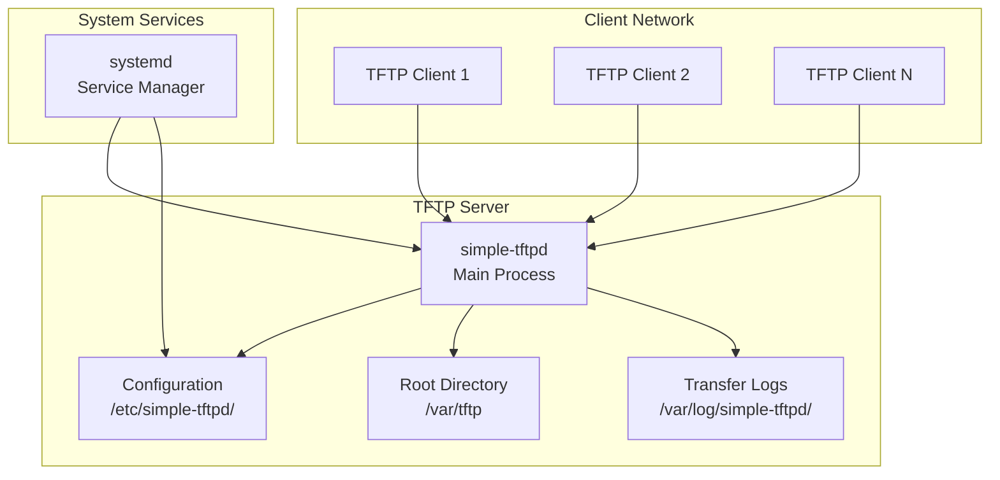
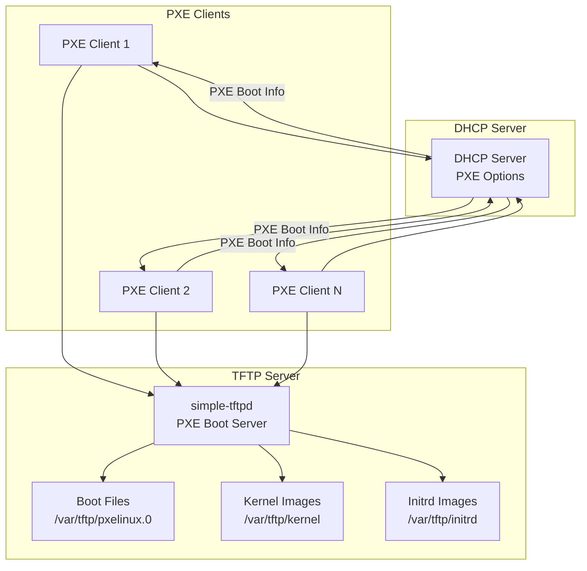

# Simple TFTP Daemon - Deployment Diagrams

## Basic Deployment Architecture

```mermaid
graph TB
    subgraph "Client Network"
        Client1[TFTP Client 1]
        Client2[TFTP Client 2]
        ClientN[TFTP Client N]
    end

    subgraph "TFTP Server"
        Server[simple-tftpd<br/>Main Process]
        Config[Configuration<br/>/etc/simple-tftpd/]
        RootDir[Root Directory<br/>/var/tftp]
        Logs[Transfer Logs<br/>/var/log/simple-tftpd/]
    end

    subgraph "System Services"
        Systemd[systemd<br/>Service Manager]
    end

    Client1 --> Server
    Client2 --> Server
    ClientN --> Server

    Systemd --> Server
    Systemd --> Config

    Server --> Config
    Server --> RootDir
    Server --> Logs
```

## PXE Boot Deployment

```mermaid
graph TB
    subgraph "PXE Clients"
        PXE1[PXE Client 1]
        PXE2[PXE Client 2]
        PXEN[PXE Client N]
    end

    subgraph "TFTP Server"
        Server[simple-tftpd<br/>PXE Boot Server]
        BootFiles[Boot Files<br/>/var/tftp/pxelinux.0]
        Kernel[Kernel Images<br/>/var/tftp/kernel]
        Initrd[Initrd Images<br/>/var/tftp/initrd]
    end

    subgraph "DHCP Server"
        DHCP[DHCP Server<br/>PXE Options]
    end

    PXE1 --> DHCP
    PXE2 --> DHCP
    PXEN --> DHCP

    DHCP -->|PXE Boot Info| PXE1
    DHCP -->|PXE Boot Info| PXE2
    DHCP -->|PXE Boot Info| PXEN

    PXE1 --> Server
    PXE2 --> Server
    PXEN --> Server

    Server --> BootFiles
    Server --> Kernel
    Server --> Initrd
```
