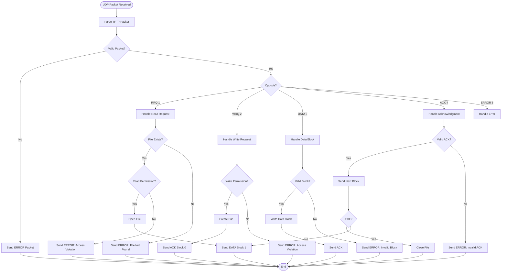
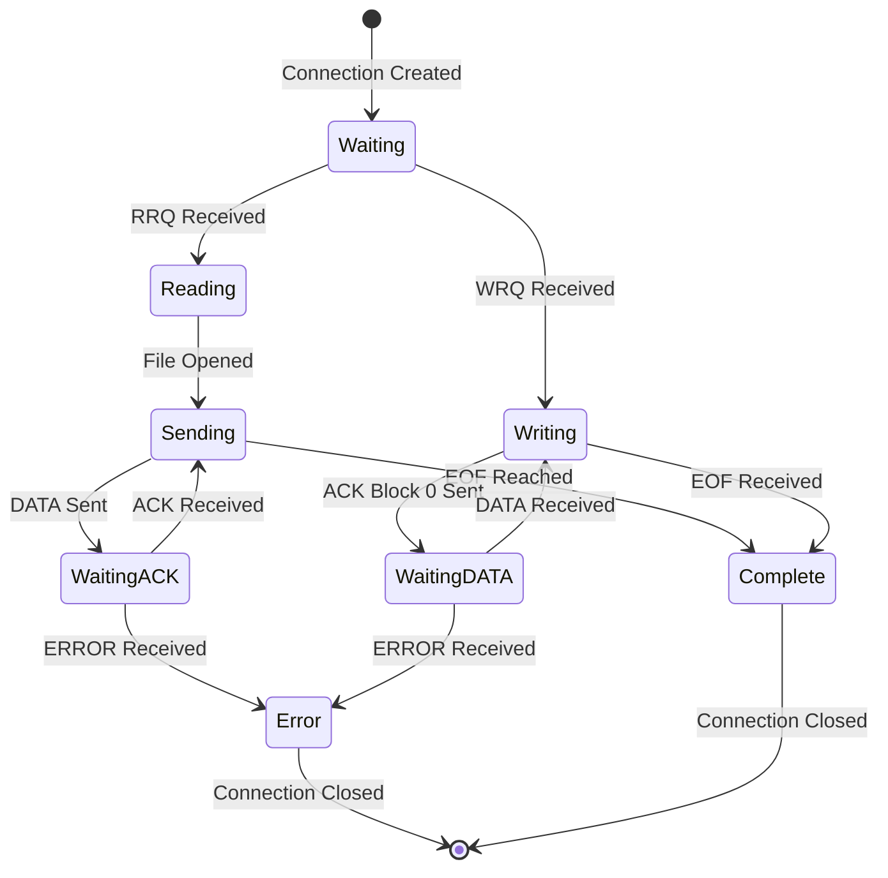

# Simple TFTP Daemon - Flow Diagrams

## TFTP Request Processing Flow

```mermaid
flowchart TD
    Start([UDP Packet Received]) --> Parse[Parse TFTP Packet]
    Parse --> Validate{Valid Packet?}
    Validate -->|No| SendError[Send ERROR Packet]
    Validate -->|Yes| CheckOpcode{Opcode?}
    
    CheckOpcode -->|RRQ 1| HandleRRQ[Handle Read Request]
    CheckOpcode -->|WRQ 2| HandleWRQ[Handle Write Request]
    CheckOpcode -->|DATA 3| HandleDATA[Handle Data Block]
    CheckOpcode -->|ACK 4| HandleACK[Handle Acknowledgment]
    CheckOpcode -->|ERROR 5| HandleERROR[Handle Error]
    
    HandleRRQ --> CheckFile{File Exists?}
    CheckFile -->|Yes| CheckPerm{Read Permission?}
    CheckFile -->|No| SendErrorFile[Send ERROR: File Not Found]
    CheckPerm -->|Yes| OpenFile[Open File]
    CheckPerm -->|No| SendErrorPerm[Send ERROR: Access Violation]
    OpenFile --> SendData[Send DATA Block 1]
    
    HandleWRQ --> CheckWrite{Write Permission?}
    CheckWrite -->|Yes| CreateFile[Create File]
    CheckWrite -->|No| SendErrorWrite[Send ERROR: Access Violation]
    CreateFile --> SendACK0[Send ACK Block 0]
    
    HandleDATA --> ValidateBlock{Valid Block?}
    ValidateBlock -->|Yes| WriteData[Write Data Block]
    ValidateBlock -->|No| SendErrorBlock[Send ERROR: Invalid Block]
    WriteData --> SendACK[Send ACK]
    
    HandleACK --> ValidateACK{Valid ACK?}
    ValidateACK -->|Yes| NextBlock[Send Next Block]
    ValidateACK -->|No| SendErrorACK[Send ERROR: Invalid ACK]
    NextBlock --> CheckEOF{EOF?}
    CheckEOF -->|Yes| CloseFile[Close File]
    CheckEOF -->|No| SendData
    
    SendError --> End([End])
    SendErrorFile --> End
    SendErrorPerm --> End
    SendErrorWrite --> End
    SendErrorBlock --> End
    SendErrorACK --> End
    SendData --> End
    SendACK0 --> End
    SendACK --> End
    CloseFile --> End
```

## TFTP Connection State Machine

```mermaid
stateDiagram-v2
    [*] --> Waiting: Connection Created
    Waiting --> Reading: RRQ Received
    Waiting --> Writing: WRQ Received
    Reading --> Sending: File Opened
    Sending --> WaitingACK: DATA Sent
    WaitingACK --> Sending: ACK Received
    WaitingACK --> Error: ERROR Received
    Sending --> Complete: EOF Reached
    Writing --> WaitingDATA: ACK Block 0 Sent
    WaitingDATA --> Writing: DATA Received
    Writing --> Complete: EOF Received
    WaitingDATA --> Error: ERROR Received
    Error --> [*]: Connection Closed
    Complete --> [*]: Connection Closed
```

