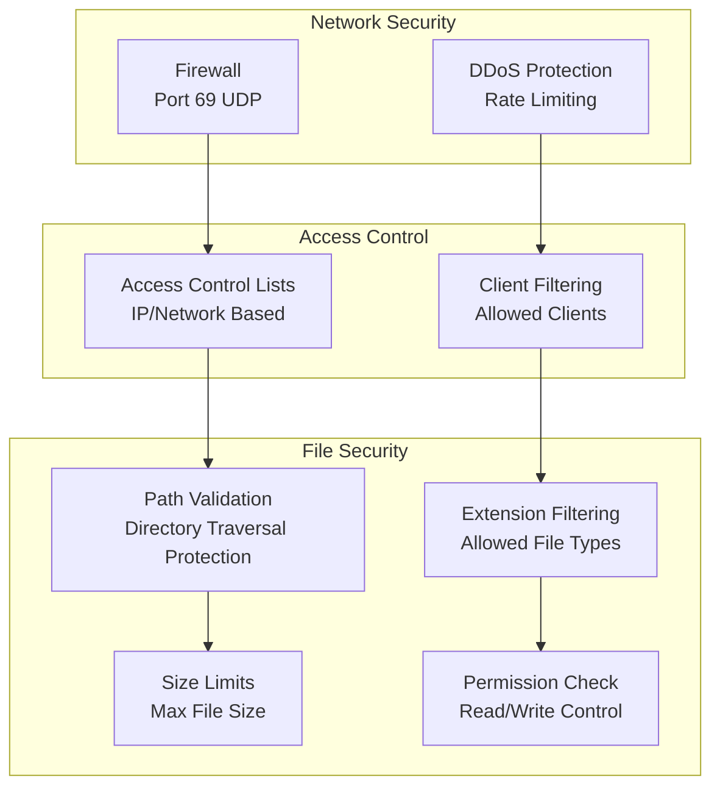
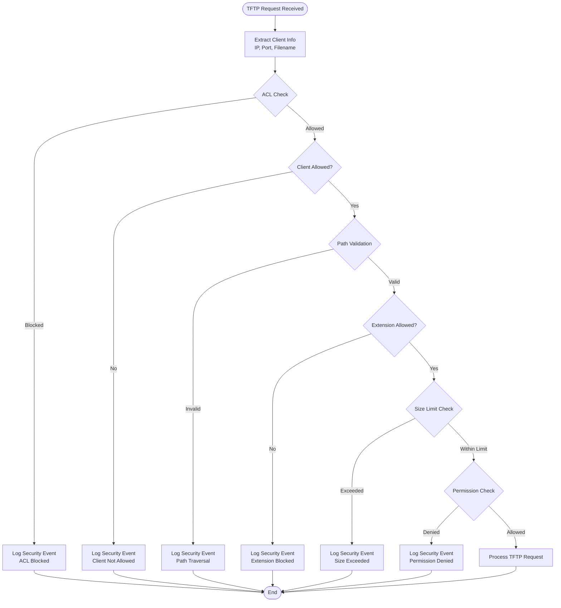

# Simple TFTP Daemon - Security Diagrams

## Security Architecture

```mermaid
graph TB
    subgraph "Network Security"
        Firewall[Firewall<br/>Port 69 UDP]
        DDoSProtection[DDoS Protection<br/>Rate Limiting]
    end

    subgraph "Access Control"
        ACL[Access Control Lists<br/>IP/Network Based]
        ClientFilter[Client Filtering<br/>Allowed Clients]
    end

    subgraph "File Security"
        PathValidation[Path Validation<br/>Directory Traversal Protection]
        ExtensionFilter[Extension Filtering<br/>Allowed File Types]
        SizeLimit[Size Limits<br/>Max File Size]
        PermissionCheck[Permission Check<br/>Read/Write Control]
    end

    Firewall --> ACL
    DDoSProtection --> ClientFilter

    ACL --> PathValidation
    ClientFilter --> ExtensionFilter

    PathValidation --> SizeLimit
    ExtensionFilter --> PermissionCheck
```

## Security Flow

```mermaid
flowchart TD
    Start([TFTP Request Received]) --> ExtractInfo[Extract Client Info<br/>IP, Port, Filename]

    ExtractInfo --> ACLCheck{ACL Check}
    ACLCheck -->|Blocked| LogBlock1[Log Security Event<br/>ACL Blocked]
    ACLCheck -->|Allowed| ClientCheck

    ClientCheck{Client Allowed?}
    ClientCheck -->|No| LogBlock2[Log Security Event<br/>Client Not Allowed]
    ClientCheck -->|Yes| PathCheck

    PathCheck{Path Validation}
    PathCheck -->|Invalid| LogBlock3[Log Security Event<br/>Path Traversal]
    PathCheck -->|Valid| ExtensionCheck

    ExtensionCheck{Extension Allowed?}
    ExtensionCheck -->|No| LogBlock4[Log Security Event<br/>Extension Blocked]
    ExtensionCheck -->|Yes| SizeCheck

    SizeCheck{Size Limit Check}
    SizeCheck -->|Exceeded| LogBlock5[Log Security Event<br/>Size Exceeded]
    SizeCheck -->|Within Limit| PermissionCheck

    PermissionCheck{Permission Check}
    PermissionCheck -->|Denied| LogBlock6[Log Security Event<br/>Permission Denied]
    PermissionCheck -->|Allowed| ProcessRequest

    ProcessRequest[Process TFTP Request] --> End([End])

    LogBlock1 --> End
    LogBlock2 --> End
    LogBlock3 --> End
    LogBlock4 --> End
    LogBlock5 --> End
    LogBlock6 --> End
```
