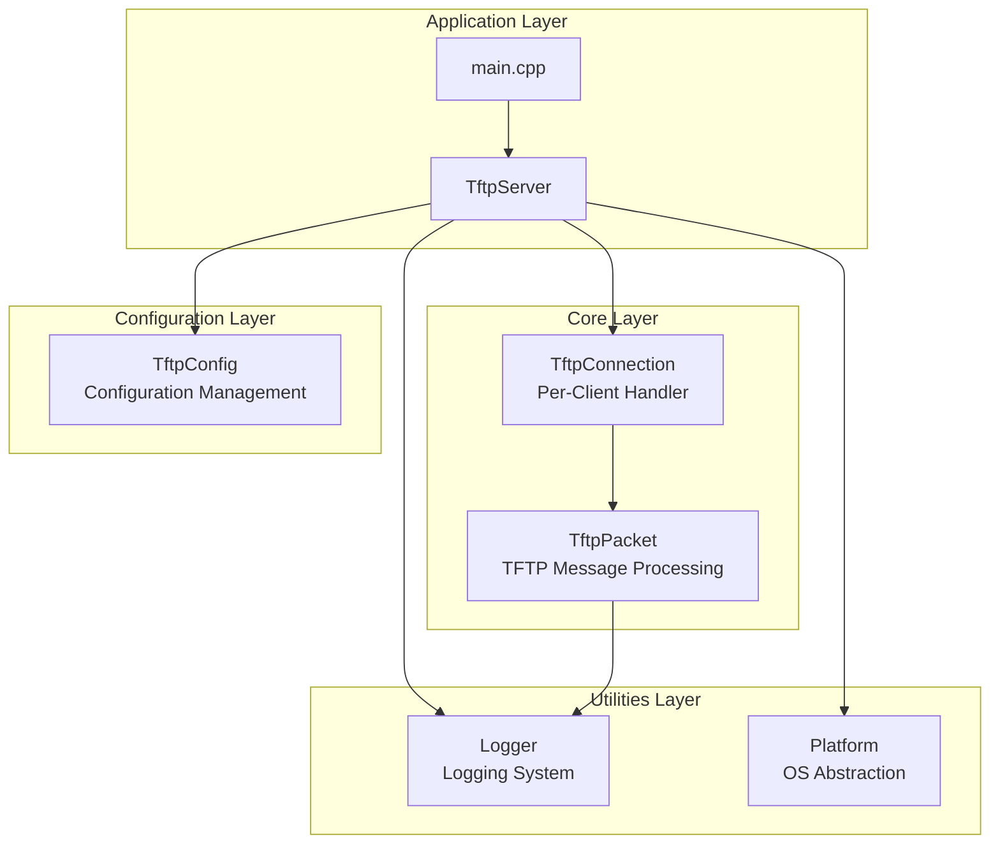
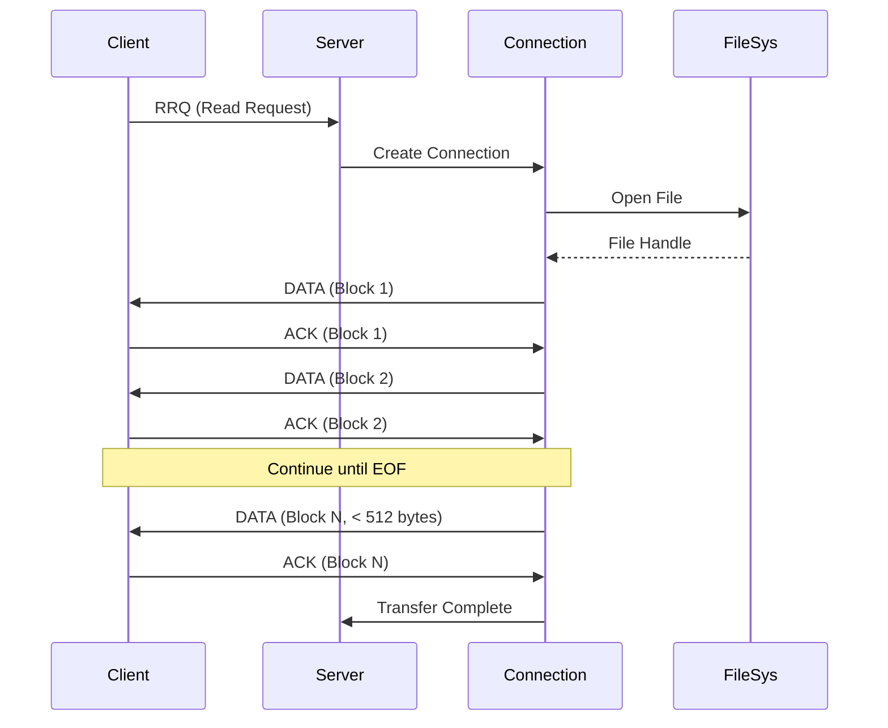
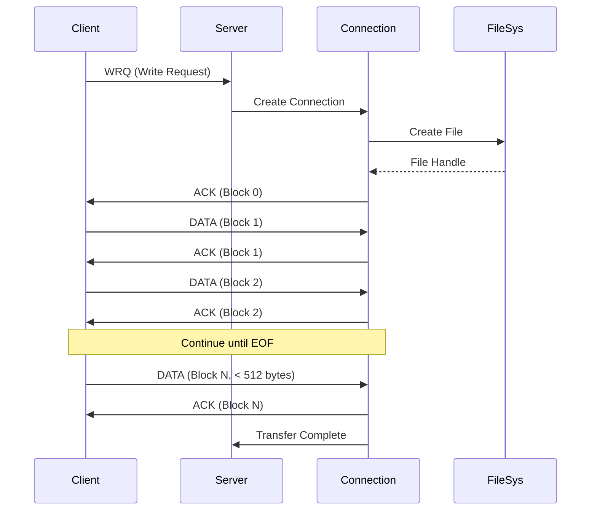

# Simple TFTP Daemon - Architecture Diagrams

## System Architecture

```mermaid
graph TB
    subgraph "Application Layer"
        Main[main.cpp]
        Server[TftpServer]
    end
    
    subgraph "Core Layer"
        Connection[TftpConnection<br/>Per-Client Handler]
        Packet[TftpPacket<br/>TFTP Message Processing]
    end
    
    subgraph "Configuration Layer"
        Config[TftpConfig<br/>Configuration Management]
    end
    
    subgraph "Utilities Layer"
        Logger[Logger<br/>Logging System]
        Platform[Platform<br/>OS Abstraction]
    end
    
    Main --> Server
    Server --> Connection
    Server --> Config
    Server --> Logger
    Server --> Platform
    
    Connection --> Packet
    Packet --> Logger
```

## TFTP Read Request Flow (RRQ)

```mermaid
sequenceDiagram
    participant Client
    participant Server
    participant Connection
    participant FileSys
    
    Client->>Server: RRQ (Read Request)
    Server->>Connection: Create Connection
    Connection->>FileSys: Open File
    FileSys-->>Connection: File Handle
    Connection->>Client: DATA (Block 1)
    Client->>Connection: ACK (Block 1)
    Connection->>Client: DATA (Block 2)
    Client->>Connection: ACK (Block 2)
    Note over Client,Connection: Continue until EOF
    Connection->>Client: DATA (Block N, < 512 bytes)
    Client->>Connection: ACK (Block N)
    Connection->>Server: Transfer Complete
```

## TFTP Write Request Flow (WRQ)

```mermaid
sequenceDiagram
    participant Client
    participant Server
    participant Connection
    participant FileSys
    
    Client->>Server: WRQ (Write Request)
    Server->>Connection: Create Connection
    Connection->>FileSys: Create File
    FileSys-->>Connection: File Handle
    Connection->>Client: ACK (Block 0)
    Client->>Connection: DATA (Block 1)
    Connection->>Client: ACK (Block 1)
    Client->>Connection: DATA (Block 2)
    Connection->>Client: ACK (Block 2)
    Note over Client,Connection: Continue until EOF
    Client->>Connection: DATA (Block N, < 512 bytes)
    Connection->>Client: ACK (Block N)
    Connection->>Server: Transfer Complete
```

