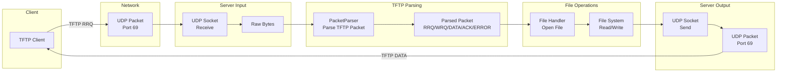

# Simple TFTP Daemon - Data Flow Diagrams

## TFTP Read Request Data Flow

```mermaid
flowchart LR
    subgraph "Client"
        C1[TFTP Client]
    end

    subgraph "Network"
        N1[UDP Packet<br/>Port 69]
    end

    subgraph "Server Input"
        S1[UDP Socket<br/>Receive]
        S2[Raw Bytes]
    end

    subgraph "TFTP Parsing"
        P1[PacketParser<br/>Parse TFTP Packet]
        P2[Parsed Packet<br/>RRQ/WRQ/DATA/ACK/ERROR]
    end

    subgraph "File Operations"
        FO1[File Handler<br/>Open File]
        FO2[File System<br/>Read/Write]
    end

    subgraph "Server Output"
        O1[UDP Socket<br/>Send]
        O2[UDP Packet<br/>Port 69]
    end

    C1 -->|TFTP RRQ| N1
    N1 --> S1
    S1 --> S2
    S2 --> P1
    P1 --> P2
    P2 --> FO1
    FO1 --> FO2
    FO2 --> O1
    O1 --> O2
    O2 -->|TFTP DATA| C1
```

## TFTP Transfer Flow

```mermaid
flowchart TB
    subgraph "Read Request"
        RR1[Client: RRQ filename]
        RR2[Server: DATA Block 1]
        RR3[Client: ACK Block 1]
        RR4[Server: DATA Block 2]
        RR5[Client: ACK Block 2]
        RR6[Continue...]
    end

    subgraph "Write Request"
        WR1[Client: WRQ filename]
        WR2[Server: ACK Block 0]
        WR3[Client: DATA Block 1]
        WR4[Server: ACK Block 1]
        WR5[Client: DATA Block 2]
        WR6[Server: ACK Block 2]
        WR7[Continue...]
    end

    RR1 --> RR2
    RR2 --> RR3
    RR3 --> RR4
    RR4 --> RR5
    RR5 --> RR6

    WR1 --> WR2
    WR2 --> WR3
    WR3 --> WR4
    WR4 --> WR5
    WR5 --> WR6
    WR6 --> WR7
```
